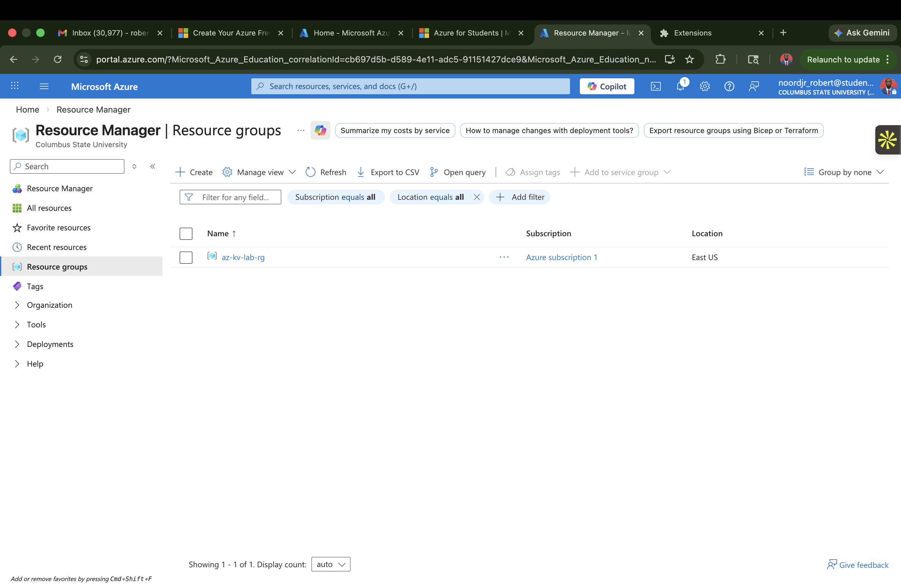
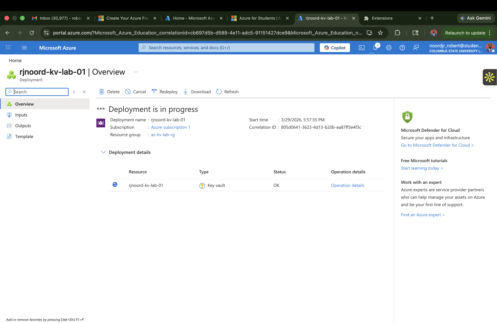
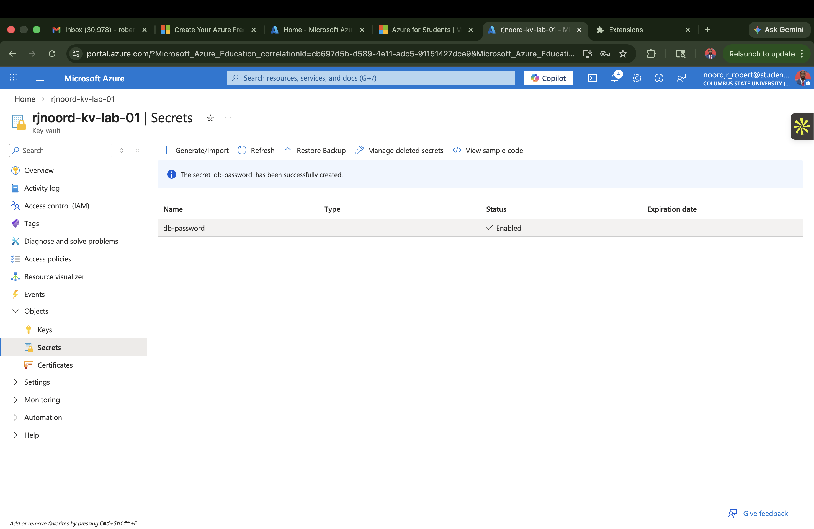
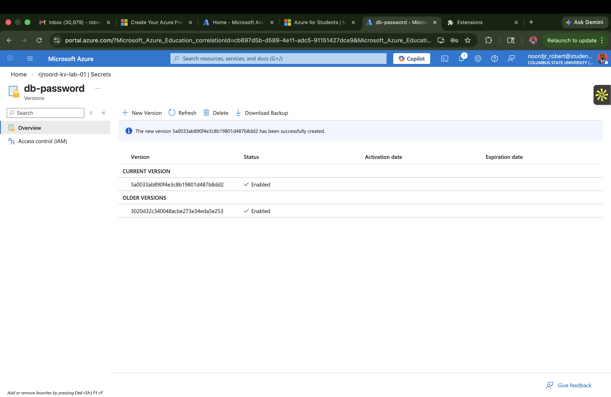
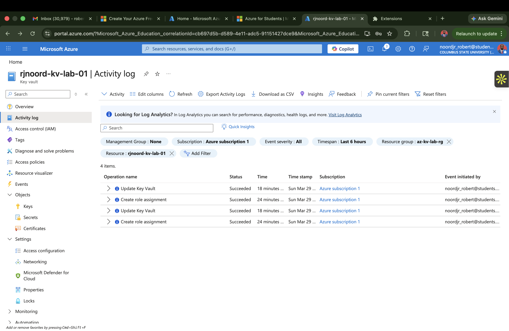

# Azure Key Vault Secrets Management Lab

## Executive Summary

This project documents a hands-on Azure Key Vault lab focused on secure secret management across the full operational lifecycle. I created the supporting resource group, deployed a Key Vault, created a secret, generated a new secret version to simulate rotation, reviewed platform activity logs, and documented how deletion and recovery fit into a resilient secrets-management workflow.

From a hiring and portfolio perspective, this lab demonstrates practical familiarity with one of the core cloud security patterns used in modern environments: keeping sensitive values out of source code and managing them through a centralized secrets platform with versioning, recovery controls, and audit visibility.

## Why This Lab Matters

Secrets are one of the easiest places for security failures to happen. API keys, passwords, connection strings, and tokens often get mishandled through hardcoded values, weak rotation discipline, or poor monitoring. Azure Key Vault exists to reduce that risk by giving teams a governed way to store, version, control, and recover secrets.

This lab shows applied understanding of:

- Azure resource organization
- Key Vault deployment and configuration awareness
- secret creation and storage
- secret versioning and rotation concepts
- soft-delete and recovery workflow awareness
- audit and monitoring visibility through Azure Activity Log

## Lab Scope

The project was built around these core objectives:

- deploy an Azure Key Vault
- create a secret in the vault
- create a new secret version to simulate rotation
- understand secret deletion and recovery behavior
- review basic platform audit and monitoring signals

## Environment

- Platform: Microsoft Azure portal
- Resource group: `az-kv-lab-rg`
- Region: `East US`
- Key Vault: `rjnoord-kv-lab-01`
- Secret shown in lab: `db-password`

## Core Competencies Demonstrated

- cloud security fundamentals
- secret lifecycle management
- Azure resource deployment
- operational security documentation
- audit trail awareness
- secure platform administration habits

## Architecture Overview

The lab uses a simple but realistic cloud security pattern:

1. A dedicated resource group contains the lab resources.
2. An Azure Key Vault serves as the secure storage location for sensitive values.
3. A secret is created and later updated with a new version.
4. Azure Activity Log provides visibility into management operations performed against the vault.
5. Soft-delete and recovery concepts protect against accidental or premature secret loss.

## Lab Walkthrough

### 1. Created the Resource Group

I first created a dedicated Azure resource group to isolate the lab resources and keep the environment organized. Using a dedicated resource group is a basic but important operational practice because it makes resource ownership, cleanup, and scope boundaries easier to manage.

This screenshot shows the resource group used for the lab:

### 2. Deployed the Azure Key Vault

After establishing the resource group, I deployed a Key Vault named `rjnoord-kv-lab-01`. The deployment screen confirms the vault resource was provisioned inside the lab resource group.

This step matters because Azure Key Vault becomes the central trust boundary for secret storage. Rather than storing secrets in application files, scripts, or loose notes, the vault provides a controlled location for sensitive values.

Key deployment takeaway:

- the vault was deployed as a dedicated Key Vault resource inside `az-kv-lab-rg`

Deployment evidence:

### 3. Created the Initial Secret

Once the vault was deployed, I created a secret named `db-password`. This represents the most common Key Vault use case: storing an application or infrastructure secret in a managed vault instead of embedding it directly into code or config files.

The screenshot shows the secret successfully created and enabled within the vault.

What this demonstrates:

- understanding of how to store a secret in Azure Key Vault
- awareness that secrets are stored as named objects inside the vault
- ability to validate that the secret exists and is active

Secret creation evidence:

### 4. Created a New Secret Version to Simulate Rotation

Secret rotation is one of the most important operational controls in secrets management. Instead of relying on a single long-lived secret value forever, teams should periodically update sensitive values and maintain a controlled process for replacing them.

In this lab, I created a new version of the `db-password` secret. The screenshot shows the current version and an older version, which is exactly what you want to see when testing secret rotation behavior.

What this demonstrates:

- understanding that Key Vault supports versioned secrets
- awareness that rotation does not require creating a brand-new secret name every time
- ability to preserve older versions for continuity and rollback-aware operations

Versioning and rotation evidence:

### 5. Reviewed Activity Logs for Basic Monitoring Awareness

Security controls are incomplete if there is no visibility into what happened. After working with the vault, I reviewed the Azure Activity Log to confirm management events associated with the resource.

The screenshot shows successful operations tied to the Key Vault, including update events and role-assignment-related actions. This is important because it introduces the monitoring mindset: changes to secure resources should be reviewable and attributable.

What this demonstrates:

- awareness that Azure records management-plane actions
- ability to review recent changes tied to the Key Vault resource
- understanding that audit visibility supports investigations, governance, and operational accountability

Audit and monitoring evidence:

## Secret Deletion and Recovery

Deletion and recovery are part of secure secret lifecycle management because mistakes happen. An engineer may delete the wrong secret, rotate the wrong value, or remove a secret before dependent systems are updated.

Azure Key Vault addresses this through soft-delete behavior and recovery workflows. In practical terms, this means a deleted secret is not always immediately and permanently lost. Instead, it can remain recoverable for a retention period, depending on configuration and platform behavior.

In this project, deletion and recovery are part of the lab scope and technical documentation, but the current screenshot set in the repository does not include the delete or recover screens. To make the portfolio evidence fully complete, the next improvement would be to add:

- a screenshot of the secret after deletion from the active secrets list
- a screenshot from `Manage deleted secrets`
- a screenshot showing successful recovery of the deleted secret

Operational importance of deletion and recovery:

- reduces the blast radius of accidental deletion
- supports safer administrative workflows
- reinforces resilience in secret management operations
- shows awareness of secure lifecycle controls beyond initial creation

## Monitoring and Audit Awareness

This lab focused on basic audit awareness rather than advanced detection engineering, but even this entry-level visibility matters.

Azure Activity Log helps answer questions such as:

- who initiated an administrative action
- what operation was performed
- when the change occurred
- whether the action succeeded

That matters for:

- governance
- troubleshooting
- compliance support
- incident review
- administrative accountability

For a more advanced version of this lab, the next step would be to connect Key Vault diagnostics to Log Analytics or Microsoft Sentinel and build searches or alerts around:

- vault updates
- access policy changes
- failed access attempts
- unusual administrative activity
- deletion and recovery events

## Security Takeaways

- secrets should not live in source code, notes, or hardcoded configuration
- Key Vault gives a governed storage layer for sensitive values
- versioning supports safer rotation workflows
- deletion and recovery awareness improves resilience
- audit visibility is essential for trust and accountability

## What This Project Demonstrates

This lab shows that I can:

- build and document a practical Azure security workflow
- work with Key Vault as a core cloud security service
- manage secret lifecycle concepts, not just one-time creation
- think beyond setup into recovery and monitoring
- present cloud security work in a clean, recruiter-readable format

## Recommended Next Enhancements

- add screenshots for secret deletion and secret recovery
- document access policies or RBAC decisions for vault access
- enable diagnostic settings to Log Analytics
- test secret expiration metadata and alerting workflows
- integrate a sample application that retrieves a secret securely from Key Vault

## Conclusion

This Azure Key Vault lab demonstrates foundational cloud security skill in a practical and portfolio-ready format. The project covers the parts of secrets management that matter operationally: deployment, controlled storage, version-aware rotation, recovery thinking, and audit visibility. That combination makes it a strong entry-level cloud security project because it reflects both technical execution and security judgment.
